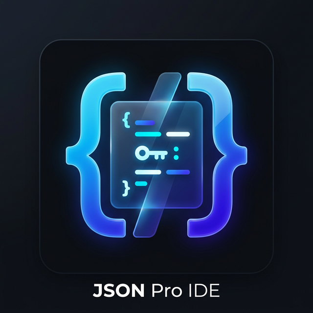

# JSON Pro IDE 🚀

A high-performance, professional-grade JSON editor built with React, Vite, and the Monaco Editor. Designed for developers who need a robust, multi-file environment with deep structural manipulation and zero storage limits.



## ✨ Features

- **🔐 Privacy First**: Your data never leaves your browser. All JSON files are stored locally using IndexedDB. No cloud, no tracking, and no data collection.
- **🚀 Monaco Power**: Integrated with the same engine as VS Code...

- **💾 IndexedDB Workspace**: Replaced `localStorage` with `idb-keyval` for limitless storage capacity and high-performance file persistence.
- **📁 Multi-File Management**: Create, delete, and switch between multiple JSON files in a seamless sidebar explorer.
- **🏗️ Structural Mutation**: Add keys/values at any level directly from the interactive Tree View/Outline pane using a touch-friendly popup.
- **🎨 Premium Themes**: Choose between 5 professional color schemes:
  - VS Code Dark & Light
  - Monokai
  - Night Owl
  - Aura (Cyberpunk style)
- **📱 Fully Responsive**: Optimized for mobile and tablets with custom tabbed navigation, touch-friendly icons, and zero-zoom focus.
- **⚡ Utility Toolkit**:
  - One-click Beautify/Minify.
  - Export to `.json` file.
  - Load data directly from external URLs.
  - Real-time syntax validation.

## 🛠️ Tech Stack

- **Framework**: [React 19](https://react.dev/)
- **Bundler**: [Vite 7](https://vitejs.dev/)
- **Styling**: [Tailwind CSS 4](https://tailwindcss.com/)
- **Editor**: [@monaco-editor/react](https://github.com/suren-atoyan/monaco-react)
- **Database**: [idb-keyval](https://github.com/jakearchibald/idb-keyval)
- **Icons**: [Lucide React](https://lucide.dev/)

## 🚀 Getting Started

### Prerequisites

- Node.js (v18 or higher)
- npm or yarn

### Installation

1. **Clone the repository**:
   ```bash
   git clone <your-repo-url>
   cd json-editor-pro
   ```

2. **Install dependencies**:
   ```bash
   npm install
   ```

3. **Run the development server**:
   ```bash
   npm run dev
   ```

4. **Build for production**:
   ```bash
   npm run build
   ```

## 📁 Project Structure

```text
src/
├── components/
│   ├── editor/      # Monaco Editor integration
│   ├── layout/      # Sidebar, Header, Footer, MenuBar
│   ├── preview/     # Interactive JSON Tree View
│   ├── modals/      # URL fetch & File creation modals
│   └── common/      # Resizers and shared UI atoms
├── hooks/           # useJsonActions, useResizer, usePersistence
├── constants/       # Workspace config and Theme definitions
├── App.jsx          # Main application orchestrator
└── main.jsx         # Entry point
```

## 📄 License

This project is licensed under the MIT License - see the LICENSE file for details.

---

Built with ❤️ for the Developer Community.
